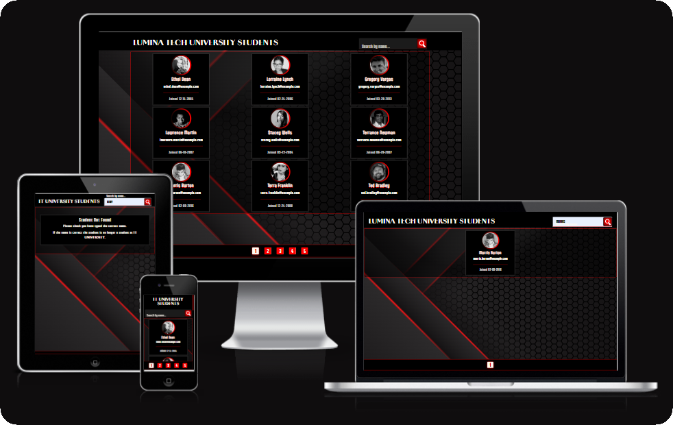
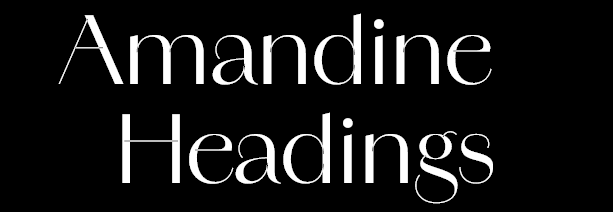
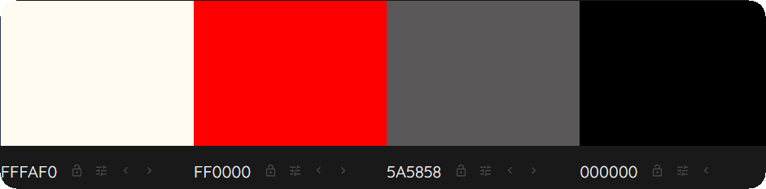
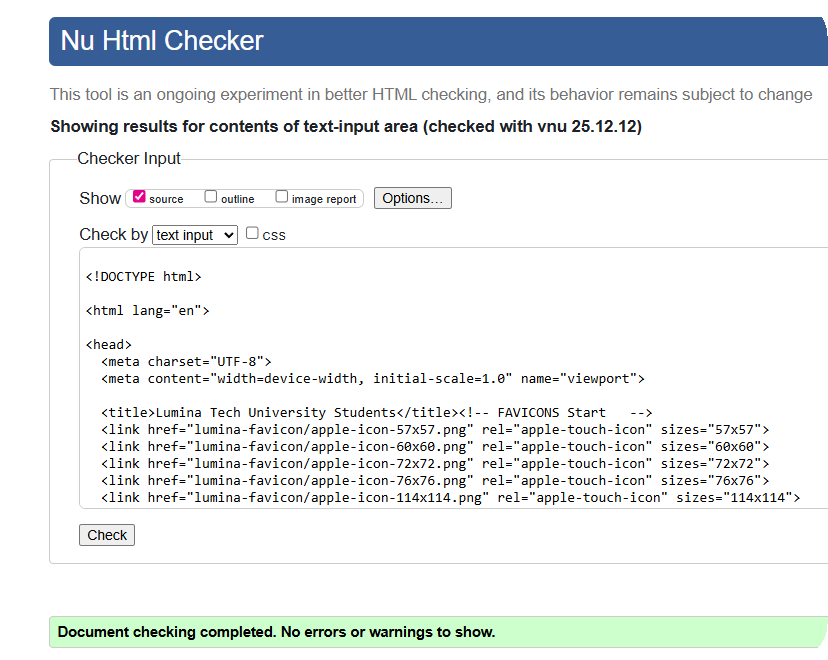
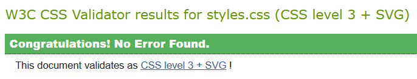

# 🎓 Lumina Tech University Directory – Pagination & Search Directory

## 🧭 Table of Contents

- [📘 Overview](#-overview)
- [🚀 Live Demo](#-live-demo)
- [🎯 Project Goals](#-project-goals)
- [🎨 Fonts & Colours Used](#-fonts--colours-used)
- [✨ Features](#-features)
- [🧰 Technologies Used](#-technologies-used)
- [🧪 Testing](#-testing)
- [🐞 Known Issues / Bugs](#-known-issues--bugs)
- [🔮 Future Enhancements](#-future-enhancements)
- [🙌 Credits & Thanks](#-credits--thanks)

## 📘 Overview

  
  

The Lumina Tech University Student Directory is a responsive web application built using vanilla JavaScript.
It displays a directory of student profiles and allows users to browse the data efficiently using pagination and search filtering.

This project focuses on DOM manipulation, array handling, and user interaction without the use of external JavaScript frameworks.

[⬆️ Back to top](#-table-of-contents)

## 🚀 Live Demo

🔗 Live site: [Lumina Tech University Student Directory](https://samatkinsonmodeste.github.io/pagination-p2-fsjs-treehouse-td/)

[⬆️ Back to top](#-table-of-contents)

## 🎯 Project Goals

The main goals of this project were to:

- Display a large dataset in a user-friendly way

- Implement pagination to limit the number of results shown per page

- Allow users to search and filter students by name

- Practice core JavaScript concepts such as:

  - Loops and conditionals

  - Array methods

  - DOM manipulation

  - Event handling

- Build a fully responsive layout that works across devices

[⬆️ Back to top](#-table-of-contents)

## 🎨 Fonts & Colours Used

- **Aptly**
  Used for body text and general UI content to ensure readability and clarity across devices.
  Sourced from **Adobe Fonts**.
  

  
  

- **Amandine**
  Used primarily for headings, including the university name, to give the project a distinctive academic identity.
  Sourced from **Adobe Fonts**.
  

  
  

  #### Colour Palette

The project uses a bold, minimal colour palette to create strong visual contrast and a clear hierarchy:

- **Red**

  - Used as the primary accent colour for emphasis and interactive elements.

- **Black**

  - Used for text, structural elements, and contrast.

- **White**

  - Used for backgrounds and spacing to maintain readability.

- **Dark Brown-Black**

  - Used as a supporting neutral tone to soften contrast while keeping a clean aesthetic.

  

  
  

[⬆️ Back to top](#-table-of-contents)

## ✨ Features

- Displays student profiles including name, email address, and profile image
- Shows a maximum of **9 students per page** using pagination
- Dynamically generates pagination buttons based on the total number of students
- Allows users to search for students by name using a search input
- Updates results in real time as the user types
- Automatically updates pagination to match filtered search results
- Responsive layout that adapts to mobile, tablet, and desktop screen sizes

[⬆️ Back to top](#-table-of-contents)

## 🧰 Technologies Used

- **HTML5**
  Used to structure the content and layout of the student directory.

- **CSS3**
  Used for custom styling, layout adjustments, and responsive behaviour.

- **Bootstrap 5**
  Used to support the responsive grid layout and assist with alignment and spacing.
  Permission was granted to use Bootstrap for this project.

- **JavaScript (ES6)**
  Used to dynamically display student data, implement pagination, and handle search filtering.

- **Git & GitHub**
  Used for version control and project management.

- **GitHub Pages**
  Used to deploy the live version of the project.

[⬆️ Back to top](#-table-of-contents)

## 🧪 Testing

### Manual Testing

The following functionality was manually tested to ensure the application works as expected:

- Pagination correctly displays a maximum of **9 students per page**
- Pagination buttons update the displayed students when clicked
- The active pagination button is visually highlighted
- Search input filters students by name in real time
- Pagination updates correctly when search results are filtered
- The layout responds correctly across mobile, tablet, and desktop screen sizes

### Validation Testing

- **HTML Validation**
  All HTML was validated using the W3C HTML Validator with no errors returned.

- **CSS Validation**
  All CSS was validated using the W3C CSS Validator with no errors returned.

Screenshots of successful HTML and CSS validation are included below.

  

  

[⬆️ Back to top](#-table-of-contents)

## 🐞 Known Issues / Bugs

- During development, an issue occurred on the final pagination page where fewer than 9 students were displayed.
  This caused a JavaScript error when attempting to access student data that did not exist.

- The issue was resolved by adjusting the loop logic to ensure array items were only accessed when they existed within the dataset bounds.

- No known unresolved bugs remain at the time of submission.

[⬆️ Back to top](#-table-of-contents)

## 🔮 Future Enhancements

Possible future improvements for this project include:

- Adding smooth slide or fade animations when pagination buttons are clicked to improve user experience
- Replacing the static data file with a live API to fetch student data dynamically
- Adding sorting options, such as alphabetical order by first or last name
- Improving accessibility features, including enhanced keyboard navigation and screen reader support

[⬆️ Back to top](#-table-of-contents)

## 🙌 Credits & Thanks

- Fonts provided by **Adobe Fonts**.
- Favicon created using [Favicon Generator](https://www.favicon-generator.org/).
- Thank you to [Brian Jensen](https://teamtreehouse.com/brianjensen) at Treehouse for continuous encouragement, support, and motivation throughout my learning journey.

[⬆️ Back to top](#-table-of-contents)
